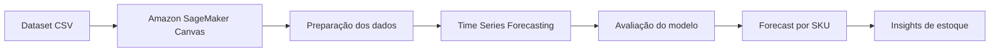
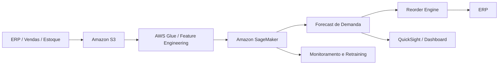

# 📦 Previsão de Estoque Inteligente na AWS com SageMaker Canvas

[](https://aws.amazon.com/sagemaker/canvas/)
[](#-modelagem)
[](https://www.dio.me/)
[](https://github.com/matheusflorindo32/lab-aws-sagemaker-canvas-estoque/actions/workflows/dataset-validation.yml)
[](https://github.com/matheusflorindo32/lab-aws-sagemaker-canvas-estoque/actions/workflows/security.yml)

> Forecasting de estoque por SKU utilizando Machine Learning no-code, séries temporais e Amazon SageMaker Canvas.

## 🎯 Resumo executivo

Este projeto evolui o desafio **“Previsão de Estoque Inteligente na AWS com SageMaker Canvas”**, proposto pela Digital Innovation One (DIO), mantendo fielmente seu objetivo original: construir um modelo de previsão de estoque com ML no-code e documentar todo o processo.

A solução utiliza como baseline o dataset mais completo disponibilizado no repositório original, com histórico diário de produtos, preços, promoções e quantidade em estoque. O modelo principal será treinado no **Amazon SageMaker Canvas** como um problema de **Time Series Forecasting**.

> **Integridade experimental:** métricas, feature importance, forecasts e screenshots só serão adicionados após a execução real no SageMaker Canvas. Este repositório não apresenta resultados simulados como se fossem resultados reais.

---

## 🧩 Problema de negócio

Decisões de estoque inadequadas podem gerar dois extremos:

- **ruptura de estoque**, com perda de vendas e pior experiência do cliente;
- **excesso de estoque**, com capital imobilizado e maior custo operacional.

O objetivo deste Lab é estimar a **quantidade futura em estoque por SKU**, utilizando o histórico disponível e variáveis como preço e promoção para apoiar decisões de acompanhamento e reposição.

### Estoque não é demanda

Neste desafio, `QUANTIDADE_ESTOQUE` é mantida como variável-alvo para respeitar o escopo da DIO. Em uma solução corporativa madura, uma evolução natural seria prever **demanda/vendas** e então integrar o forecast a lead time, safety stock, reorder point, nível de serviço e custos de ruptura/armazenagem.

---

## 📊 Dataset selecionado

Arquivo principal:

```text
datasets/dataset-1000-com-preco-promocional-e-renovacao-estoque.csv
```

Características verificadas pela CI:

- **1.000 registros**;
- **25 SKUs** (`1000` a `1024`);
- **40 observações por SKU**;
- frequência diária regular;
- período de **2023-12-31 a 2024-02-08**;
- **0** campos ausentes;
- **0** duplicatas exatas;
- **0** chaves `ID_PRODUTO + DATA_EVENTO` duplicadas;
- **0** pontos diários ausentes;
- **0** linhas inválidas;
- preço e indicador promocional disponíveis como variáveis explicativas.

### Dicionário de dados

| Campo | Papel | Descrição |
|---|---|---|
| `ID_PRODUTO` | Item ID | Identificador do produto/SKU |
| `DATA_EVENTO` | Timestamp | Data da observação |
| `PRECO` | Covariável | Preço observado |
| `FLAG_PROMOCAO` | Covariável | Indicador binário de promoção |
| `QUANTIDADE_ESTOQUE` | Target | Quantidade disponível em estoque |

Os datasets originais da DIO permanecem preservados. Consulte [`datasets/README.md`](datasets/README.md).

---

## 🔎 Análise exploratória descritiva

A EDA é reproduzível, sem dependências externas:

```bash
python scripts/analyze_dataset.py
```

Resultados obtidos no GitHub Actions sobre o dataset selecionado:

| Indicador | Resultado |
|---|---:|
| Preço médio | 78,64 |
| Preço mínimo | 18,31 |
| Preço máximo | 187,04 |
| Estoque médio | 55,73 |
| Estoque mínimo | 1 |
| Estoque máximo | 100 |
| Registros promocionais | 20,60% |
| Estoque médio em promoção | 57,93 |
| Estoque médio sem promoção | 55,15 |

Top 5 SKUs por volatilidade descritiva do estoque (desvio-padrão populacional): `1003` (32,13), `1009` (32,12), `1018` (31,90), `1024` (31,66) e `1017` (31,55).

Essas estatísticas **não demonstram causalidade** entre preço, promoção e estoque. A análise detalhada está em [`docs/03-analise-exploratoria.md`](docs/03-analise-exploratoria.md).

---

## 🏗️ Arquitetura do Lab



### 🚀 Evolução futura



A segunda arquitetura é apenas uma **evolução futura**, não uma implementação já realizada neste Lab.

---

## 🤖 Modelagem

Configuração planejada para a primeira execução real:

| Parâmetro | Configuração |
|---|---|
| Tipo de problema | Time Series Forecasting |
| Target | `QUANTIDADE_ESTOQUE` |
| Item ID | `ID_PRODUTO` |
| Timestamp | `DATA_EVENTO` |
| Frequência | Daily |
| Horizonte inicial | 7 dias |
| Covariáveis | `PRECO`, `FLAG_PROMOCAO` |

O passo a passo operacional está em [`docs/04-configuracao-sagemaker-canvas.md`](docs/04-configuracao-sagemaker-canvas.md).

---

## 🧪 Validação e testes

O projeto utiliza somente a biblioteca padrão do Python para as verificações auxiliares:

```bash
python -m py_compile scripts/*.py
python -m unittest discover -s tests -v
python scripts/validate_dataset.py
python scripts/analyze_dataset.py
python scripts/scan_secrets.py
```

O validador verifica:

- existência do arquivo e schema esperado;
- cardinalidade do baseline;
- quantidade de SKUs e observações por SKU;
- intervalo temporal;
- campos ausentes;
- duplicatas exatas;
- duplicidade da chave `SKU + data`;
- regularidade diária por SKU;
- tipos básicos;
- preço negativo;
- flag promocional fora de `0/1`;
- estoque negativo.

Na execução auditada do GitHub Actions, **7 testes unitários passaram**, os scripts compilaram e o dataset baseline foi validado com sucesso.

---

## 📈 Avaliação do modelo

Após o treinamento real, esta seção será atualizada somente com métricas apresentadas na execução do Canvas.

| Métrica | Resultado | Interpretação |
|---|---:|---|
| WAPE | **PENDENTE** | aguardando execução real no Canvas |
| MAPE | **PENDENTE** | aguardando execução real no Canvas |
| RMSE | **PENDENTE** | aguardando execução real no Canvas |
| MASE | **PENDENTE** | aguardando execução real no Canvas |
| Average wQL | **PENDENTE** | aguardando execução real no Canvas |

Nem toda configuração/interface apresenta necessariamente todas essas métricas. Serão registradas apenas as que o Canvas efetivamente fornecer, e nenhuma métrica será interpretada isoladamente.

A definição, limitações e regras de interpretação de cada métrica estão em [`docs/06-avaliacao-modelo.md`](docs/06-avaliacao-modelo.md).

### Feature importance / impact

Será documentada somente a importância realmente exibida pela interface, com atenção a:

- `PRECO`;
- `FLAG_PROMOCAO`;
- comportamento histórico;
- efeitos temporais/calendário, quando disponibilizados pelo fluxo utilizado.

**Status:** ⏳ PENDENTE DE EXECUÇÃO NA AWS.

---

## 🔮 Forecast

Após o treinamento, serão geradas previsões de estoque por SKU e os resultados serão organizados em [`results/`](results/README.md).

Quando disponíveis na execução utilizada, intervalos/quantis de previsão também poderão ser documentados para representar a incerteza do forecast.

### Questões de negócio que serão analisadas

- quais SKUs apresentam maior risco de baixo estoque?
- quais produtos apresentam maior volatilidade?
- promoções coincidem com mudanças mais rápidas no estoque?
- preço e promoção ajudam a explicar parte do comportamento observado?
- quais produtos merecem acompanhamento operacional mais frequente?

Nenhuma conclusão de modelo será declarada antes de observar os resultados reais.

---

## 🧠 Extensão experimental: cenários what-if

Se a configuração do Canvas utilizada permitir fornecer valores futuros para covariáveis, poderá ser realizada uma análise experimental com cenários como:

1. sem promoção;
2. produto em promoção;
3. redução de preço;
4. aumento de preço.

Essa análise é uma **extensão experimental** e não um requisito obrigatório da DIO. Nenhuma previsão de cenário será inventada.

---

## ⚠️ Limitações

- dataset educacional/sintético;
- série temporal curta;
- apenas 25 SKUs;
- ausência de vendas/demanda explícita;
- ausência de lead time;
- ausência de fornecedores;
- ausência de safety stock;
- ausência de service level;
- ausência de custos de ruptura;
- ausência de custos de armazenagem;
- ausência de fatores externos mais ricos;
- previsão de estoque não equivale diretamente a previsão de demanda.

Essas limitações são importantes para não extrapolar a validade do experimento. Consulte [`docs/09-limitacoes-e-evolucoes.md`](docs/09-limitacoes-e-evolucoes.md).

---

## 🔐 Segurança AWS e do repositório

Nunca versione:

```text
AWS_ACCESS_KEY_ID
AWS_SECRET_ACCESS_KEY
AWS_SESSION_TOKEN
.env
.aws/
*.pem
*.key
*.p12
*.pfx
```

O repositório possui um scanner leve em `scripts/scan_secrets.py`, executado por [`.github/workflows/security.yml`](.github/workflows/security.yml) com permissão `contents: read`. Na execução auditada, nenhum padrão de segredo de alto risco foi detectado.

Antes de adicionar screenshots, remova Account IDs, credenciais, e-mails, usuários IAM, ARNs sensíveis e dados privados desnecessários. O checklist de evidências está em [`assets/screenshots/README.md`](assets/screenshots/README.md).

Consulte também [`SECURITY.md`](SECURITY.md).

---

## 💰 Custos e cleanup

SageMaker Canvas e recursos relacionados podem gerar custos. Este projeto não publica preços nem custo real sem evidência verificável da conta utilizada.

- orientação de custos: [`docs/10-custos-aws.md`](docs/10-custos-aws.md);
- checklist de encerramento: [`docs/12-cleanup-aws.md`](docs/12-cleanup-aws.md).

> Fechar a aba do navegador não deve ser considerado evidência suficiente de que todos os recursos faturáveis foram encerrados.

---

## 📁 Estrutura do repositório

```text
.
├── .github/workflows/
│   ├── dataset-validation.yml
│   └── security.yml
├── assets/
│   └── screenshots/README.md
├── datasets/
│   ├── README.md
│   └── *.csv
├── docs/
│   ├── 03-analise-exploratoria.md
│   ├── 04-configuracao-sagemaker-canvas.md
│   ├── 06-avaliacao-modelo.md
│   ├── 09-limitacoes-e-evolucoes.md
│   ├── 10-custos-aws.md
│   └── 12-cleanup-aws.md
├── results/
│   ├── metrics/README.md
│   ├── predictions/README.md
│   ├── exports/README.md
│   └── README.md
├── scripts/
│   ├── analyze_dataset.py
│   ├── scan_secrets.py
│   └── validate_dataset.py
├── tests/
│   ├── test_analyze_dataset.py
│   ├── test_scan_secrets.py
│   └── test_validate_dataset.py
├── .gitignore
├── CHANGELOG.md
├── CONTRIBUTING.md
├── SECURITY.md
└── README.md
```

---

## ✅ Checklist do desafio DIO

| Requisito | Status |
|---|---|
| Fork do repositório | ✅ |
| Dataset selecionado | ✅ |
| Dataset documentado | ✅ |
| Validação local/CI executada | ✅ |
| Análise exploratória descritiva | ✅ |
| Security scan executado | ✅ |
| Upload no Canvas | ⏳ |
| Modelo configurado no Canvas | ⏳ |
| Modelo treinado | ⏳ |
| Métricas analisadas | ⏳ |
| Feature impact analisado | ⏳ |
| Forecast gerado | ⏳ |
| Resultados exportados | ⏳ |
| Insights finais do modelo | ⏳ |
| README final pós-execução | ⏳ |

---

## 🚦 Status do projeto

### ✅ Implementado e verificado

- fork e preservação da baseline DIO;
- seleção e documentação do dataset principal;
- validação estrutural e temporal do dataset;
- análise exploratória descritiva reproduzível;
- testes unitários e compilação Python em CI;
- arquitetura do Lab;
- CI de validação;
- scanner de segredos e CI de segurança;
- guia de execução do Canvas;
- documentação de avaliação, custos e cleanup AWS;
- política de integridade dos resultados.

### ⏳ Pendente de execução AWS

- upload do dataset no SageMaker Canvas;
- configuração e treinamento do modelo;
- métricas e feature importance/impact;
- forecast e exportação dos resultados;
- screenshots reais e sanitizados;
- interpretação técnica e de negócio pós-modelo.

### 🧪 Experimental

- análise what-if de preço/promoção, condicionada ao fluxo utilizado no Canvas.

### 🚀 Evolução futura

- previsão explícita de demanda;
- integração com S3/Glue/ERP;
- políticas de reorder point, safety stock e service level;
- dashboards;
- MLOps, monitoramento de drift e retraining.

---

## 📚 Origem e créditos

Projeto desenvolvido como evolução educacional do Lab da **Digital Innovation One**:

- repositório-base: [`digitalinnovationone/lab-aws-sagemaker-canvas-estoque`](https://github.com/digitalinnovationone/lab-aws-sagemaker-canvas-estoque);
- plataforma de ML: Amazon SageMaker Canvas.

Os datasets originais foram preservados para manter rastreabilidade com o desafio.

## 👤 Autor

**Matheus Florindo de Deus**  
GitHub: [`@matheusflorindo32`](https://github.com/matheusflorindo32)

---

> **Próxima etapa:** executar o treinamento real no Amazon SageMaker Canvas, coletar métricas, screenshots e forecasts, e então concluir a análise técnica e de negócio sem fabricar resultados.
