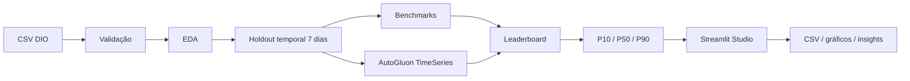
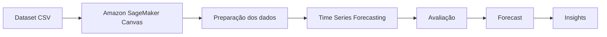
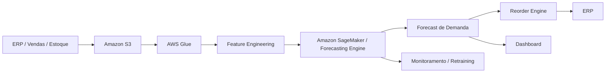

# 📦 Inventory Forecasting Studio

### DIO SageMaker Canvas Challenge + implementação open source com AutoGluon TimeSeries

[](https://www.dio.me/)
[](https://www.python.org/)
[](https://auto.gluon.ai/)
[](https://streamlit.io/)
[](https://github.com/matheusflorindo32/lab-aws-sagemaker-canvas-estoque/actions/workflows/dataset-validation.yml)
[](https://github.com/matheusflorindo32/lab-aws-sagemaker-canvas-estoque/actions/workflows/python-forecasting.yml)
[](https://github.com/matheusflorindo32/lab-aws-sagemaker-canvas-estoque/actions/workflows/security.yml)

> Forecasting multi-SKU com validação temporal, benchmarks, AutoML probabilístico, P10/P50/P90, leaderboard, Streamlit, exports e CI reproduzível.

---

## 🎯 Resumo executivo

Este repositório evolui o desafio **“Previsão de Estoque Inteligente na AWS com SageMaker Canvas”**, da Digital Innovation One, preservando o problema original de prever `QUANTIDADE_ESTOQUE` por SKU.

O projeto possui **duas trilhas explicitamente separadas**:

| Trilha | Status | Papel |
|---|---|---|
| ☁️ Amazon SageMaker Canvas | ⏳ **NÃO EXECUTADA** | fluxo original proposto pelo desafio DIO, documentado passo a passo |
| 🐍 Inventory Forecasting Studio | ✅ **EXECUTADA** | implementação open source reproduzível em Python + AutoGluon + Streamlit + GitHub Actions |

Nenhuma execução de SageMaker Canvas é simulada ou apresentada como realizada.

> **Integridade experimental:** todos os números apresentados na trilha Python foram produzidos por código executado sobre o dataset real do repositório e verificados no GitHub Actions. Métricas AWS permanecem pendentes.

---

## 🧩 Problema de negócio

Gestão inadequada de estoque pode gerar:

- **ruptura**, com indisponibilidade e perda de vendas;
- **excesso**, com capital imobilizado e custo operacional;
- dificuldade de priorizar SKUs com comportamento mais instável.

O objetivo é estimar o comportamento futuro de estoque para cada SKU em horizonte de **7 dias**, preservando o target definido pelo desafio.

### ⚠️ Estoque não é demanda

`QUANTIDADE_ESTOQUE` foi mantida como target para respeitar a proposta da DIO. Em uma implementação corporativa, uma evolução mais robusta seria prever **demanda/vendas** e então incorporar lead time, safety stock, reorder point, nível de serviço e custos de ruptura/armazenagem.

---

## 📊 Dataset

Dataset principal:

```text
datasets/dataset-1000-com-preco-promocional-e-renovacao-estoque.csv
```

Validação executada em CI:

| Propriedade | Resultado |
|---|---:|
| Registros | 1.000 |
| SKUs | 25 |
| Observações por SKU | 40 |
| Frequência | diária |
| Data inicial | 2023-12-31 |
| Data final | 2024-02-08 |
| Campos ausentes | 0 |
| Duplicatas exatas | 0 |
| Chaves `SKU + data` duplicadas | 0 |
| Pontos diários ausentes | 0 |
| Linhas inválidas | 0 |

### Dicionário de dados

| Campo | Papel |
|---|---|
| `ID_PRODUTO` | Item ID / SKU |
| `DATA_EVENTO` | Timestamp |
| `PRECO` | Covariável |
| `FLAG_PROMOCAO` | Covariável |
| `QUANTIDADE_ESTOQUE` | Target |

Os três CSVs originais da DIO permanecem preservados. Consulte [`datasets/README.md`](datasets/README.md).

---

## 🔎 EDA reproduzível

```bash
python scripts/analyze_dataset.py
```

Resultados verificados:

| Indicador | Resultado |
|---|---:|
| Preço médio | 78,64 |
| Preço mínimo / máximo | 18,31 / 187,04 |
| Estoque médio | 55,73 |
| Estoque mínimo / máximo | 1 / 100 |
| Registros promocionais | 20,60% |
| Estoque médio em promoção | 57,93 |
| Estoque médio sem promoção | 55,15 |

Top 5 SKUs por volatilidade descritiva: `1003`, `1009`, `1018`, `1024`, `1017`.

Esses valores são descritivos e **não demonstram causalidade**. Veja [`docs/03-analise-exploratoria.md`](docs/03-analise-exploratoria.md).

---

# 🐍 Trilha executada — Inventory Forecasting Studio

## Arquitetura



### Protocolo temporal

Para cada SKU:

- **33 dias** → treino;
- **7 dias finais** → holdout;
- 25 SKUs × 7 dias = **175 observações reais de teste**.

Nenhum target do holdout é utilizado no treino.

---

## 🧪 Benchmarks

Foram executados três baselines transparentes:

- `Naive`;
- `SeasonalNaive7`;
- `Drift`.

| Rank | Modelo | MAE | RMSE | WAPE | MAPE | MASE | WQL |
|---:|---|---:|---:|---:|---:|---:|---:|
| 1 | Naive | 42.828571 | 50.790944 | 0.721714 | 1.261017 | 2.837697 | 0.662766 |
| 2 | SeasonalNaive7 | 44.045714 | 48.260010 | 0.742224 | 2.417650 | 2.849374 | 0.718580 |
| 3 | Drift | 47.422143 | 56.697834 | 0.799121 | 1.145737 | 3.164879 | 0.709079 |

O workflow verificou **525 linhas de previsão**: 175 por modelo.

Os baselines são deliberadamente simples e apresentaram erro elevado. Isso estabelece uma referência honesta para avaliar modelos mais expressivos.

---

## 🤖 AutoGluon TimeSeries — execução real

Ambiente registrado pelo workflow:

```text
AutoGluon: 1.6.1
Python: 3.12.14
CPU: 4
GPU: não disponível
Treino: 825 linhas / 25 séries
prediction_length: 7
eval_metric: WQL
quantiles: [0.1, 0.5, 0.9]
known covariates: PRECO, FLAG_PROMOCAO
preset: medium_quality
random_seed: 123
```

Modelos treinados:

`SeasonalNaive` · `RecursiveTabular` · `DirectTabular` · `ETS` · `Theta` · `Chronos2` · `Toto2` · `WeightedEnsemble`

Tempo de treinamento reportado pelo AutoGluon: **11,99 s** após instalação das dependências.

### Leaderboard no holdout

O AutoGluon inverte o sinal de métricas de perda internamente para seguir `higher_is_better`. A coluna **WQL loss** abaixo usa a magnitude positiva, em que menor é melhor.

| Rank | Modelo | WQL loss |
|---:|---|---:|
| 1 | **WeightedEnsemble** | **0.223493** |
| 2 | DirectTabular | 0.228474 |
| 3 | Chronos2 | 0.265239 |
| 4 | Toto2 | 0.283392 |
| 5 | RecursiveTabular | 0.407835 |
| 6 | SeasonalNaive | 0.416962 |
| 7 | ETS | 0.448723 |
| 8 | Theta | 0.480026 |

### Ensemble vencedor

| Componente | Peso |
|---|---:|
| DirectTabular | **81%** |
| Toto2 | 12% |
| Chronos2 | 5% |
| RecursiveTabular | 2% |

---

## 📈 Métricas independentes do melhor modelo

As 175 previsões do `WeightedEnsemble` foram reconciliadas com o holdout real e as métricas foram recalculadas independentemente:

| Métrica | AutoGluon WeightedEnsemble | Melhor baseline (`Naive`) |
|---|---:|---:|
| MAE | **21.265417** | 42.828571 |
| RMSE | **26.538214** | 50.790944 |
| WAPE | **0.358348** | 0.721714 |
| MAPE | 1.472072 | 1.261017 |
| WQL | **0.223493** | 0.662766 |

No protocolo utilizado, o AutoGluon reduziu substancialmente MAE, RMSE, WAPE e WQL em relação ao melhor baseline simples. O MAPE não melhorou, reforçando que métricas de forecasting devem ser analisadas em conjunto — especialmente com valores reais de estoque muito baixos.

**Isso não é evidência de desempenho de produção.** É um resultado de um holdout curto em dataset educacional.

Detalhes: [`docs/07-resultados-python.md`](docs/07-resultados-python.md).

---

## 🎯 P10 / P50 / P90

O AutoGluon gerou quantis probabilísticos nativos:

- **P10** → `0.1`;
- **P50** → `0.5`;
- **P90** → `0.9`.

As 175 previsões do holdout com `mean`, `0.1`, `0.5` e `0.9` foram preservadas como artefato do GitHub Actions.

Nos benchmarks leves, os quantis são construídos empiricamente a partir de inovações históricas e são explicitamente tratados como baseline de incerteza — não como equivalentes aos quantis nativos do AutoGluon.

---

## 🔬 Feature importance

Resultado real do AutoGluon:

| Covariável | Importance |
|---|---:|
| `PRECO` | 0.000169 |
| `FLAG_PROMOCAO` | -0.000625 |

Os valores ficaram praticamente em zero. Nesta execução, **não há evidência de contribuição material dessas covariáveis** para o ensemble.

Isso não significa que preço ou promoção não importem no mundo real e não estabelece causalidade; apenas descreve o comportamento desse experimento.

---

# 🖥️ Streamlit — Inventory Forecasting Studio

O arquivo [`app.py`](app.py) fornece uma interface visual para:

- visualizar dataset e EDA;
- selecionar horizonte;
- executar benchmarks;
- visualizar leaderboard;
- selecionar modelo e SKU;
- plotar forecast;
- visualizar P10/P50/P90;
- baixar leaderboard e forecast em CSV;
- consultar o status dos artefatos AutoGluon.

### Executar a interface

```bash
python -m venv .venv
pip install -r requirements-app.txt
streamlit run app.py
```

Guia: [`docs/08-inventory-forecasting-studio.md`](docs/08-inventory-forecasting-studio.md).

### Executar AutoGluon

```bash
pip install -r requirements-ml.txt
python scripts/train_autogluon.py --time-limit 300 --presets medium_quality
```

---

# ☁️ Trilha original DIO — Amazon SageMaker Canvas

## Status: ⏳ NÃO EXECUTADA

A trilha original foi mantida integralmente como referência e documentação do desafio.

Configuração planejada:

| Parâmetro | Configuração |
|---|---|
| Tipo | Time Series Forecasting |
| Target | `QUANTIDADE_ESTOQUE` |
| Item ID | `ID_PRODUTO` |
| Timestamp | `DATA_EVENTO` |
| Frequência | Daily |
| Horizonte | 7 dias |
| Covariáveis | `PRECO`, `FLAG_PROMOCAO` |



Guia: [`docs/04-configuracao-sagemaker-canvas.md`](docs/04-configuracao-sagemaker-canvas.md).

### Métricas Canvas

| Métrica | Resultado |
|---|---|
| WAPE | **NÃO EXECUTADO** |
| MAPE | **NÃO EXECUTADO** |
| RMSE | **NÃO EXECUTADO** |
| MASE | **NÃO EXECUTADO** |
| Average wQL | **NÃO EXECUTADO** |

Nenhum resultado Python é apresentado como se fosse proveniente da AWS.

---

## 🧠 Arquitetura corporativa futura



🚀 **Evolução futura — não implementada neste Lab.**

---

## ✅ Qualidade, testes e CI

Workflows:

- `dataset-validation.yml` — schema, integridade, EDA e testes;
- `python-forecasting.yml` — compilação, **17 testes**, backtest, artefatos e verificação das 525 previsões;
- `autogluon-experiment.yml` — instalação, treino, avaliação, feature importance e artefatos AutoGluon;
- `security.yml` — scanner de padrões de segredos.

Comandos locais leves:

```bash
python -m py_compile scripts/*.py src/inventory_forecasting/*.py
python -m unittest discover -s tests -v
python scripts/validate_dataset.py
python scripts/analyze_dataset.py
python scripts/run_benchmarks.py
python scripts/scan_secrets.py
```

---

## 🔐 Segurança

O repositório não exige credenciais AWS para a trilha Python.

Nunca versione:

```text
AWS_ACCESS_KEY_ID
AWS_SECRET_ACCESS_KEY
AWS_SESSION_TOKEN
.env
.aws/
*.pem
*.key
*.p12
*.pfx
```

O scanner dedicado roda com `contents: read`. Consulte [`SECURITY.md`](SECURITY.md).

---

## 📦 Artefatos e rastreabilidade

Resultados versionados:

```text
results/
├── metrics/benchmark_metrics.csv
├── exports/benchmark_leaderboard.csv
└── autogluon/
    ├── leaderboard.csv
    ├── evaluation.txt
    ├── feature_importance.csv
    └── metrics_summary.csv
```

Artefatos completos preservados no GitHub Actions:

- `inventory-forecasting-benchmarks`;
- `inventory-forecasting-autogluon`.

A execução AutoGluon também exportou as **175 previsões** com `mean`, P10, P50 e P90.

---

## ⚠️ Limitações

- dataset educacional/sintético;
- apenas 40 dias por SKU;
- somente 25 SKUs;
- apenas um holdout final de 7 dias;
- resets periódicos de estoque geram descontinuidades;
- ausência de vendas/demanda explícita;
- ausência de lead time, fornecedor, safety stock e service level;
- ausência de custos de ruptura/armazenagem;
- preço e promoção tiveram feature importance quase nula nesta execução;
- covariáveis futuras precisam ser conhecidas ou definidas por cenário;
- previsão de estoque não equivale a política automática de reposição.

Veja [`docs/09-limitacoes-e-evolucoes.md`](docs/09-limitacoes-e-evolucoes.md).

---

## 📁 Estrutura principal

```text
.
├── .github/workflows/
│   ├── dataset-validation.yml
│   ├── python-forecasting.yml
│   ├── autogluon-experiment.yml
│   └── security.yml
├── datasets/
├── docs/
│   ├── 03-analise-exploratoria.md
│   ├── 04-configuracao-sagemaker-canvas.md
│   ├── 05-implementacao-python.md
│   ├── 06-avaliacao-modelo.md
│   ├── 07-resultados-python.md
│   ├── 08-inventory-forecasting-studio.md
│   ├── 09-limitacoes-e-evolucoes.md
│   ├── 10-custos-aws.md
│   └── 12-cleanup-aws.md
├── results/
├── scripts/
├── src/inventory_forecasting/
├── tests/
├── app.py
├── requirements-app.txt
├── requirements-ml.txt
├── SECURITY.md
└── README.md
```

---

## ✅ Checklist

### Entrega técnica open source

- [x] Fork e rastreabilidade com a DIO
- [x] Dataset preservado e validado
- [x] EDA reproduzível
- [x] Holdout temporal sem leakage do target
- [x] Benchmarks executados
- [x] Métricas reais
- [x] AutoGluon TimeSeries executado
- [x] Leaderboard real
- [x] P10/P50/P90 reais do AutoGluon
- [x] Feature importance real
- [x] Streamlit Studio implementado
- [x] Exports e artefatos
- [x] Testes e CI
- [x] Security scan

### Requisito específico SageMaker Canvas

- [ ] Upload no Canvas
- [ ] Treinamento no Canvas
- [ ] Métricas do Canvas
- [ ] Screenshots do Canvas
- [ ] Export do Canvas

> Portanto, a implementação open source está executada e reproduzível, mas **não deve ser descrita como execução do SageMaker Canvas** se a avaliação da DIO exigir especificamente evidências da plataforma AWS.

---

## 📚 Documentação

- [Implementação Python](docs/05-implementacao-python.md)
- [Resultados Python](docs/07-resultados-python.md)
- [Inventory Forecasting Studio](docs/08-inventory-forecasting-studio.md)
- [Configuração SageMaker Canvas](docs/04-configuracao-sagemaker-canvas.md)
- [Métricas](docs/06-avaliacao-modelo.md)
- [Limitações](docs/09-limitacoes-e-evolucoes.md)
- [Custos AWS](docs/10-custos-aws.md)
- [Cleanup AWS](docs/12-cleanup-aws.md)

---

## 👤 Autor

**Matheus Florindo de Deus**  
GitHub: [`@matheusflorindo32`](https://github.com/matheusflorindo32)

---

## 📌 Status final desta etapa

**✅ Inventory Forecasting Studio open source: implementado e executado.**  
**✅ Benchmarks e AutoGluon: resultados reais verificados.**  
**⏳ Amazon SageMaker Canvas: documentado, mas não executado.**
