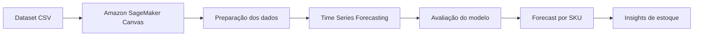
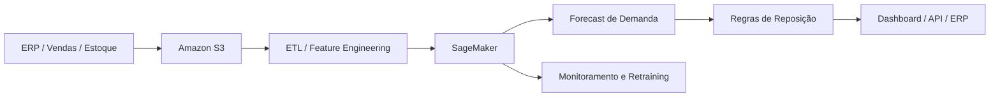

# 📦 Previsão de Estoque Inteligente na AWS com SageMaker Canvas

[](https://aws.amazon.com/sagemaker/canvas/)
[](#-modelagem)
[](https://www.dio.me/)
[](SECURITY.md)

> Forecasting de estoque por SKU utilizando Machine Learning no-code, séries temporais e Amazon SageMaker Canvas.

## 🎯 Resumo executivo

Este projeto evolui o desafio **“Previsão de Estoque Inteligente na AWS com SageMaker Canvas”**, proposto pela Digital Innovation One (DIO), mantendo fielmente seu objetivo original: construir um modelo de previsão de estoque com ML no-code e documentar todo o processo.

A solução utiliza como baseline o dataset mais completo disponibilizado no repositório original, com histórico diário de produtos, preços, promoções e quantidade em estoque. O modelo principal será treinado no **Amazon SageMaker Canvas** como um problema de **Time Series Forecasting**.

> **Integridade experimental:** métricas, feature importance, forecasts e screenshots só serão adicionados após a execução real no SageMaker Canvas. Este repositório não apresenta resultados simulados como se fossem resultados reais.

---

## 🧩 Problema de negócio

Decisões de estoque inadequadas podem gerar dois extremos:

- **ruptura de estoque**, com perda de vendas e pior experiência do cliente;
- **excesso de estoque**, com capital imobilizado e maior custo operacional.

O objetivo deste Lab é estimar a **quantidade futura em estoque por SKU**, utilizando o histórico disponível e variáveis como preço e promoção para apoiar decisões de acompanhamento e reposição.

### Estoque não é demanda

Neste desafio, `QUANTIDADE_ESTOQUE` é mantida como variável-alvo para respeitar o escopo da DIO. Em uma solução corporativa madura, uma evolução natural seria prever **demanda/vendas** e então integrar o forecast a lead time, safety stock, reorder point, nível de serviço e custos de ruptura/armazenagem.

---

## 📊 Dataset selecionado

Arquivo principal:

```text
datasets/dataset-1000-com-preco-promocional-e-renovacao-estoque.csv
```

Características validadas a partir do arquivo:

- **1.000 registros**;
- **25 SKUs** (`1000` a `1024`);
- frequência diária;
- período de **2023-12-31 a 2024-02-08**;
- preço e indicador promocional disponíveis como variáveis explicativas.

### Dicionário de dados

| Campo | Papel | Descrição |
|---|---|---|
| `ID_PRODUTO` | Item ID | Identificador do produto/SKU |
| `DATA_EVENTO` | Timestamp | Data da observação |
| `PRECO` | Covariável | Preço observado |
| `FLAG_PROMOCAO` | Covariável | Indicador binário de promoção |
| `QUANTIDADE_ESTOQUE` | Target | Quantidade disponível em estoque |

Os datasets originais da DIO permanecem preservados. Consulte [`datasets/README.md`](datasets/README.md).

---

## 🏗️ Arquitetura do Lab



### Evolução futura



A segunda arquitetura é apenas uma **evolução futura**, não uma implementação já realizada neste Lab.

---

## 🤖 Modelagem

Configuração planejada para a primeira execução real:

| Parâmetro | Configuração |
|---|---|
| Tipo de problema | Time Series Forecasting |
| Target | `QUANTIDADE_ESTOQUE` |
| Item ID | `ID_PRODUTO` |
| Timestamp | `DATA_EVENTO` |
| Frequência | Daily |
| Horizonte inicial | 7 dias |
| Covariáveis | `PRECO`, `FLAG_PROMOCAO` |

O passo a passo operacional está em [`docs/04-configuracao-sagemaker-canvas.md`](docs/04-configuracao-sagemaker-canvas.md).

---

## 🧪 Validação local dos dados

Foi incluído um script simples e sem dependências externas para validar o dataset antes do upload no Canvas:

```bash
python scripts/validate_dataset.py
```

Ele verifica:

- existência do arquivo;
- schema esperado;
- quantidade de registros;
- SKUs únicos;
- intervalo de datas;
- valores ausentes;
- duplicatas exatas;
- tipos básicos;
- flag promocional;
- estoque negativo.

A mesma verificação é executada por GitHub Actions em pull requests e pushes relevantes.

---

## 📈 Avaliação do modelo

Após o treinamento real, esta seção será atualizada somente com métricas apresentadas na execução do Canvas.

| Métrica | Resultado | Interpretação |
|---|---:|---|
| WAPE | **PENDENTE** | preencher após execução real |
| MAPE | **PENDENTE** | preencher após execução real |
| RMSE | **PENDENTE** | preencher após execução real |
| MASE | **PENDENTE** | preencher após execução real |
| Average wQL | **PENDENTE** | preencher após execução real |

Nem toda configuração/interface apresenta necessariamente todas essas métricas. Serão registradas apenas as que o Canvas efetivamente fornecer.

### Feature impact

Também será documentada a influência das variáveis disponibilizada pela interface, com atenção especial a:

- `PRECO`;
- `FLAG_PROMOCAO`;
- comportamento histórico do estoque.

**Status:** PENDENTE DE EXECUÇÃO NA AWS.

---

## 🔮 Forecast

Após o treinamento, serão geradas previsões de estoque por SKU e os resultados serão organizados em [`results/`](results/README.md).

Quando disponíveis na execução utilizada, intervalos/quantis de previsão também poderão ser documentados para demonstrar incerteza do forecast.

### Questões de negócio que serão analisadas

- quais SKUs apresentam maior risco de baixo estoque?
- quais produtos apresentam maior volatilidade?
- promoções coincidem com mudanças mais rápidas no estoque?
- preço e promoção ajudam a explicar parte do comportamento observado?
- quais produtos merecem acompanhamento operacional mais frequente?

Nenhuma conclusão será declarada antes de observar os resultados reais.

---

## 🧠 Extensão experimental: cenários what-if

Se a configuração do Canvas utilizada permitir fornecer valores futuros para covariáveis, poderá ser realizada uma análise experimental com cenários como:

1. sem promoção;
2. produto em promoção;
3. redução de preço;
4. aumento de preço.

Essa análise é uma **extensão experimental** e não um requisito obrigatório da DIO.

---

## ⚠️ Limitações

- dataset educacional e pequeno;
- série temporal curta;
- ausência de vendas/demanda explícita;
- ausência de lead time;
- ausência de fornecedor;
- ausência de safety stock;
- ausência de custos de ruptura e armazenamento;
- ausência de variáveis externas mais ricas;
- previsão de estoque não equivale diretamente a previsão de demanda.

Essas limitações são importantes para não extrapolar a validade do experimento.

---

## 🔐 Segurança AWS

Este repositório possui uma baseline de segurança específica para evitar exposição de credenciais.

Nunca versione:

```text
AWS_ACCESS_KEY_ID
AWS_SECRET_ACCESS_KEY
AWS_SESSION_TOKEN
.env
.aws/
*.pem
*.key
```

Antes de adicionar screenshots, remova Account IDs, credenciais, e-mails, usuários IAM, ARNs sensíveis e dados privados desnecessários.

Consulte [`SECURITY.md`](SECURITY.md).

---

## 💰 Custos e cleanup

SageMaker Canvas e recursos relacionados podem gerar custos. Após o Lab, revise e encerre o que não for mais necessário.

Checklist completo: [`docs/12-cleanup-aws.md`](docs/12-cleanup-aws.md).

> Fechar a aba do navegador não deve ser considerado evidência suficiente de que todos os recursos faturáveis foram encerrados.

---

## 📁 Estrutura do repositório

```text
.
├── .github/workflows/
│   └── dataset-validation.yml
├── datasets/
│   ├── README.md
│   └── *.csv
├── docs/
│   ├── 04-configuracao-sagemaker-canvas.md
│   └── 12-cleanup-aws.md
├── results/
│   └── README.md
├── scripts/
│   └── validate_dataset.py
├── .gitignore
├── CHANGELOG.md
├── CONTRIBUTING.md
├── SECURITY.md
└── README.md
```

---

## ✅ Checklist do desafio DIO

| Requisito | Status |
|---|---|
| Fork do repositório | ✅ |
| Dataset selecionado | ✅ |
| Dataset documentado | ✅ |
| Validação local preparada | ✅ |
| Upload no Canvas | ⏳ |
| Modelo configurado no Canvas | ⏳ |
| Modelo treinado | ⏳ |
| Métricas analisadas | ⏳ |
| Feature impact analisado | ⏳ |
| Forecast gerado | ⏳ |
| Resultados exportados | ⏳ |
| Insights documentados | ⏳ |
| README final pós-execução | ⏳ |

---

## 🚦 Status do projeto

### ✅ Implementado

- fork e preservação da baseline DIO;
- seleção do dataset principal;
- documentação do schema;
- arquitetura do Lab;
- validação local do dataset;
- CI de validação;
- baseline de segurança;
- guia de execução do Canvas;
- checklist de cleanup AWS;
- política de integridade dos resultados.

### 🧪 Experimental

- análise what-if de preço/promoção, condicionada ao fluxo utilizado no Canvas.

### 🚀 Evolução futura

- previsão explícita de demanda;
- integração com S3/ETL/ERP;
- políticas de reorder point e safety stock;
- dashboards;
- MLOps, monitoramento de drift e retraining.

---

## 📚 Origem e créditos

Projeto desenvolvido como evolução educacional do Lab da **Digital Innovation One**:

- repositório-base: `digitalinnovationone/lab-aws-sagemaker-canvas-estoque`;
- plataforma de ML: Amazon SageMaker Canvas.

Os datasets originais foram preservados para manter rastreabilidade com o desafio.

## 👤 Autor

**Matheus Florindo de Deus**  
GitHub: [`@matheusflorindo32`](https://github.com/matheusflorindo32)

---

> Próxima etapa: executar o treinamento real no Amazon SageMaker Canvas, coletar métricas, screenshots e forecasts, e então concluir a análise técnica e de negócio sem fabricar resultados.
